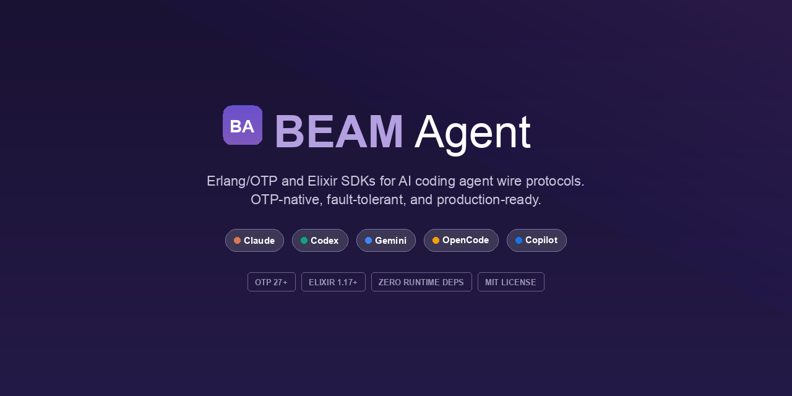

<p align="center">
  
</p>

# BEAM Agent

Canonical BEAM SDKs for integrating subscription-backed coding agents into
Erlang/OTP and Elixir applications.

The canonical public SDK surfaces are now:

- `beam_agent` for Erlang
- `BeamAgent` for Elixir

They let callers choose **Claude Code**, **Codex CLI**, **Gemini CLI**,
**OpenCode**, or **GitHub Copilot** at runtime while working against one
capability-oriented API surface.

## Architecture

All five backends share a three-layer architecture:

```
Consumer → beam_agent / BeamAgent (canonical public API)
         → beam_agent_session_engine (gen_statem — lifecycle, queue, telemetry)
         → beam_agent_session_handler callbacks (per-backend protocol logic)
         → beam_agent_transport (byte I/O — port, HTTP, WebSocket)
```

Each backend implements `beam_agent_session_handler` with ~6 required callbacks.
The engine provides all shared orchestration (state machine, consumer/queue,
telemetry, error recovery) so handlers focus only on what is unique to their
backend's wire protocol. Zero additional processes — the engine gen_statem IS
the session process.

```
                     +----------------------+
                     |      beam_agent      |
                     | canonical Erlang SDK |
                     +----------+-----------+
                                |
               +----------------+----------------+
               |  beam_agent_session_engine      |
               |  (gen_statem: lifecycle/queue/   |
               |   telemetry/error recovery)     |
               +----------------+----------------+
                                |
       +-------------+----------+----------+-------------+-------------+
       |             |                     |             |             |
 +-----+-----+ +-----+-----+         +-----+-----+ +-----+-----+ +-----+-----+
 | Claude    | | Codex     |         | Gemini    | | OpenCode  | | Copilot   |
 | handler   | | handler   |         | handler   | | handler   | | handler   |
 | port/jsonl| | port/rpc  |         | port/rpc  | | http/sse  | | port/clrpc|
 +-----------+ +-----------+         +-----------+ +-----------+ +-----------+
```

Those backend handlers are internal implementation modules inside the single
`beam_agent` project, not separate SDK packages.

All five handlers normalize messages into `beam_agent:message()` — a common map
type you can pattern-match on regardless of which agent you're talking to.

`beam_agent` is not only shared plumbing. It is the union-capability layer the
repo is building and verifying toward: when a backend supports a feature
natively, the handler can route to that implementation; when it does not,
`beam_agent` provides the universal fallback recorded in the architecture
matrices.

To add a new backend, implement a `beam_agent_session_handler` callback module.
See the moduledoc in `beam_agent_session_handler.erl` for a complete example.

## Quick Start

### Erlang

Add the canonical SDK to your `rebar.config` deps:

```erlang
{deps, [
    {beam_agent, {path, "."}}
]}.
```

```erlang
%% Start a Claude Code session through the canonical SDK
{ok, Session} = beam_agent:start_session(#{
    backend => claude,
    cli_path => "/usr/local/bin/claude",
    permission_mode => <<"bypassPermissions">>
}),

%% Blocking query — returns all messages
{ok, Messages} = beam_agent:query(Session, <<"Explain OTP supervisors">>),

%% Find the result
[Result | _] = [M || #{type := result} = M <- Messages],
io:format("~s~n", [maps:get(content, Result, <<>>)]),

beam_agent:stop(Session).
```

### Elixir

```elixir
# In mix.exs
defp deps do
  [{:beam_agent_ex, path: "beam_agent_ex"}]
end
```

```elixir
{:ok, session} = BeamAgent.start_session(backend: :claude, cli_path: "claude")

# Streaming query — lazy enumerable
session
|> BeamAgent.stream!("Explain GenServer")
|> Enum.each(fn msg ->
  case msg.type do
    :text -> IO.write(msg.content)
    :result -> IO.puts("\n--- Done ---")
    _ -> :ok
  end
end)

BeamAgent.stop(session)
```

Backend-specific wrappers such as `ClaudeEx`, `CodexEx`, `GeminiEx`,
`OpencodeEx`, and `CopilotEx` still exist. Use them when you want a preset
backend boundary or direct access to backend-native APIs from within the single
`beam_agent_ex` package.

## Adapters at a Glance

| Adapter | CLI | Transport | Protocol | Bidirectional |
|---------|-----|-----------|----------|---------------|
| `claude_agent_sdk` | `claude` | Port | JSONL | Yes (control protocol) |
| `codex_app_server` | `codex` | Port / WebSocket | JSON-RPC / JSONL / Realtime WS | Yes (app-server or direct realtime) or No (exec) |
| `gemini_cli_client` | `gemini --experimental-acp` | Port | JSON-RPC over NDJSON | Yes (persistent ACP session) |
| `opencode_client` | `opencode serve` | HTTP + SSE | REST + SSE | Yes |
| `copilot_client` | `copilot` | Port | JSON-RPC / Content-Length | Yes (bidirectional) |

## Canonical API Surface

`beam_agent` / `BeamAgent` expose the shared lifecycle/query surface directly:

```erlang
start_session(Opts)    -> {ok, Pid} | {error, Reason}
stop(Pid)              -> ok
query(Pid, Prompt)     -> {ok, [Message]} | {error, Reason}
query(Pid, Prompt, Params) -> {ok, [Message]} | {error, Reason}
health(Pid)            -> ready | connecting | initializing | active_query | error
session_info(Pid)      -> {ok, Map} | {error, Reason}
child_spec(Opts)       -> supervisor:child_spec()
```

Elixir adds `stream!/3` and `stream/3` (lazy `Stream.resource/3`-based
enumerables) on top of the same canonical surface.

Beyond the lifecycle/query surface, the canonical SDK exposes the following
capability families. Their status and route shape for each backend/capability
pair are tracked via `support_level`, `implementation`, and `fidelity` in the
capability registry. All families have universal fallback coverage:

- shared session history/state
- shared/native thread management
- runtime provider and agent defaults
- universal config/provider fallbacks for backends without native admin APIs
- universal review/realtime participation for backends without native review APIs
- canonical attachment materialization for backends without native rich input parts
- catalog accessors for tools/skills/plugins/agents
- capability introspection (`support_level`, `implementation`, `fidelity`)
- raw native escape hatches for backend-specific APIs
- backend event streaming through native transports or the universal event bus

Shared session history/state and thread management:

```erlang
%% Universal session history/state
list_sessions(Opts)                    -> {ok, [SessionMeta]}
get_session(SessionId)                 -> {ok, SessionMeta} | {error, not_found}
get_session_messages(SessionId, Opts)  -> {ok, [Message]} | {error, not_found}
delete_session(SessionId)              -> ok
fork_session(SessionPid, Opts)         -> {ok, SessionMeta} | {error, not_found}
revert_session(SessionPid, Selector)   -> {ok, map()} | {error, Reason}
unrevert_session(SessionPid)           -> {ok, map()} | {error, not_found}
share_session(SessionPid, Opts)        -> {ok, map()} | {error, not_found}
unshare_session(SessionPid)            -> ok | {error, not_found}
summarize_session(SessionPid, Opts)    -> {ok, map()} | {error, not_found}

%% Universal/native thread state
thread_start(SessionPid, Opts)         -> {ok, ThreadMeta} | {error, Reason}
thread_resume(SessionPid, ThreadId)    -> {ok, ThreadMeta} | {error, not_found}
thread_list(SessionPid)                -> {ok, [ThreadMeta]} | {error, Reason}
thread_fork(SessionPid, ThreadId, Opts)-> {ok, ThreadMeta} | {error, not_found}
thread_read(SessionPid, ThreadId, Opts)-> {ok, map()} | {error, not_found}
thread_archive(SessionPid, ThreadId)   -> {ok, map()} | {error, not_found}
thread_unarchive(SessionPid, ThreadId) -> {ok, map()} | {error, not_found}
thread_rollback(SessionPid, ThreadId, Selector) ->
    {ok, map()} | {error, Reason}
```

The Elixir `BeamAgent` wrapper exposes those stores directly through
`BeamAgent.SessionStore` and `BeamAgent.Threads`, and the runtime/catalog
layers through `BeamAgent.Runtime`, `BeamAgent.Catalog`,
`BeamAgent.Capabilities`, and `BeamAgent.Raw`.

## Unified Message Format

All adapters normalize messages to `beam_agent:message()`:

```erlang
#{type := text, content := <<"Hello!">>}
#{type := tool_use, tool_name := <<"Bash">>, tool_input := #{...}}
#{type := tool_result, tool_name := <<"Bash">>, content := <<"output...">>}
#{type := result, content := <<"Final answer">>, duration_ms := 5432}
#{type := error, content := <<"Something went wrong">>}
#{type := thinking, content := <<"Let me consider...">>}
#{type := system, subtype := <<"init">>, system_info := #{...}}
```

Pattern match on `type` for dispatch:

```erlang
handle_message(#{type := text, content := Content}) ->
    io:format("~s", [Content]);
handle_message(#{type := tool_use, tool_name := Name}) ->
    io:format("Using tool: ~s~n", [Name]);
handle_message(#{type := result} = Msg) ->
    io:format("Done! Cost: $~.4f~n", [maps:get(total_cost_usd, Msg, 0.0)]);
handle_message(_Other) ->
    ok.
```

## SDK Features

### Backend Event Streams

The public API exposes a canonical event-stream interface for every backend:

```elixir
session
|> BeamAgent.event_stream!(timeout: 30_000)
|> Enum.each(&IO.inspect/1)
```

Backends with richer native event feeds keep them. For the rest, BeamAgent
provides the shared event-bus fallback documented in
`docs/architecture/backend_conformance_matrix.md`.

### Codex Direct Realtime Voice

Codex can also run a direct realtime session instead of the app-server path:

```erlang
{ok, Session} = beam_agent:start_session(#{
    backend => codex,
    transport => realtime,
    api_key => <<"sk-live-key">>,
    voice => <<"alloy">>
}),
{ok, #{thread_id := ThreadId}} =
    beam_agent:thread_realtime_start(Session, #{mode => <<"voice">>}),
ok = beam_agent:thread_realtime_append_text(Session, ThreadId, #{text => <<"Hello">>}),
ok = beam_agent:stop(Session).
```

That path uses the direct realtime websocket transport for Codex-native
audio/text sessions while the app-server transport remains available for the
broader CLI control-plane surface.

### MCP (Model Context Protocol)

The SDK includes a full MCP 2025-06-18 implementation with four layers:

| Layer | Module | Purpose |
|-------|--------|---------|
| Protocol | `beam_agent_mcp_protocol` | JSON-RPC 2.0 message constructors, validators, and encoders for the MCP spec |
| Server dispatch | `beam_agent_mcp_dispatch` | Server-side state machine — lifecycle, capability negotiation, request routing |
| Client dispatch | `beam_agent_mcp_client_dispatch` | Client-side state machine — request/response tracking, timeouts, server capability discovery |
| Tool registry | `beam_agent_tool_registry` | In-process tool registration, dispatch, and session-scoped registry management |
| Transports | `beam_agent_mcp_transport_stdio`, `beam_agent_mcp_transport_http` | Stdio (line-delimited JSON) and Streamable HTTP transports |

The public API is `beam_agent_mcp` (Erlang) / `BeamAgent.MCP` (Elixir).

#### In-Process MCP Tool Servers

Define custom tools as Erlang functions that Claude can call:

```erlang
Tool = beam_agent_mcp:tool(
    <<"lookup_user">>,
    <<"Look up a user by ID">>,
    #{<<"type">> => <<"object">>,
      <<"properties">> => #{<<"id">> => #{<<"type">> => <<"string">>}}},
    fun(Input) ->
        Id = maps:get(<<"id">>, Input, <<>>),
        {ok, [#{type => text, text => <<"User: ", Id/binary>>}]}
    end
),
Server = beam_agent_mcp:server(<<"my-tools">>, [Tool]),
{ok, Session} = beam_agent:start_session(#{
    backend => claude,
    sdk_mcp_servers => [Server]
}).
```

#### MCP Server Dispatch

Build a full MCP server that handles the protocol lifecycle:

```erlang
%% Create a server dispatch state machine
State = beam_agent_mcp:new_dispatch(
    #{name => <<"my-server">>, version => <<"1.0.0">>},
    #{tools => true, resources => true},
    #{tool_registry => Registry, provider => MyProviderModule}
),

%% Feed incoming JSON-RPC messages through the state machine
{Responses, NewState} = beam_agent_mcp:dispatch_message(IncomingMsg, State).
```

#### MCP Client Dispatch

Connect to an MCP server as a client:

```erlang
%% Create a client dispatch state machine
Client = beam_agent_mcp:new_client(
    #{name => <<"my-client">>, version => <<"1.0.0">>},
    #{roots => true, sampling => true},
    #{handler => MyHandlerModule}
),

%% Build and send the initialize request
{InitMsg, Client1} = beam_agent_mcp:client_send_initialize(Client),
%% ... send InitMsg over transport, receive response ...
{Events, Client2} = beam_agent_mcp:client_handle_message(Response, Client1),

%% Complete the handshake
{InitializedMsg, Client3} = beam_agent_mcp:client_send_initialized(Client2),

%% List available tools
{ToolsReq, Client4} = beam_agent_mcp:client_send_tools_list(Client3).
```

### SDK Lifecycle Hooks

Register callbacks at key session lifecycle points:

```erlang
%% Block dangerous tool calls
Hook = beam_agent_hooks:hook(pre_tool_use, fun(Ctx) ->
    case maps:get(tool_name, Ctx, <<>>) of
        <<"Bash">> -> {deny, <<"Shell access denied">>};
        _ -> ok
    end
end),
{ok, Session} = beam_agent:start_session(#{
    backend => claude,
    sdk_hooks => [Hook]
}).
```

Hook events: `pre_tool_use`, `post_tool_use`, `user_prompt_submit`, `stop`,
`session_start`, `session_end`.

### Telemetry

All adapters emit telemetry events at key points (query lifecycle, state
transitions, buffer overflow). The `telemetry` library is an **optional**
dependency — when present, events are emitted via `telemetry:execute/3`; when
absent, emission is a silent no-op with zero overhead.

To opt in, add `{telemetry, "~> 1.3"}` to your application's `deps` and
`applications` list, then attach handlers:

```erlang
telemetry:attach(my_handler, [beam_agent, query, stop], fun handle/4, #{}).
```

Events: `[beam_agent, query, start|stop|exception]`,
`[beam_agent, message, received]`, `[beam_agent, session, start|stop]`.

### ETS Initialization

Call `beam_agent:init/0,1` before starting sessions to initialize the
SDK's ETS tables. In the default `public` mode all tables use public
access (zero overhead). Opt into `hardened` mode to protect tables and
proxy writes through a linked owner process:

```erlang
%% Default — public access, zero overhead
ok = beam_agent:init().

%% Hardened — protected tables, proxied writes, zero-cost reads
ok = beam_agent:init(#{table_access => hardened}).
```

If `init/1` is never called, tables are created lazily with public access
on first use.

### Supervisor Integration

Embed sessions in your supervision tree:

```erlang
%% In your supervisor init/1
ok = beam_agent:init(),
Children = [
    beam_agent:child_spec(#{
        backend => claude,
        cli_path => "/usr/local/bin/claude",
        session_id => <<"worker-1">>
    })
],
{ok, {#{strategy => one_for_one}, Children}}.
```

### Universal Session and Thread Stores

The common session/thread APIs are backed by ETS-based stores inside
`beam_agent` so every adapter can expose the same high-level capability
surface, even when the underlying SDK does not implement it directly.

```erlang
%% Query shared history
{ok, Sessions} = beam_agent_session_store:list_sessions(),
{ok, Messages} = beam_agent_session_store:get_session_messages(<<"sid">>),

%% Create and inspect universal threads
{ok, Thread} = beam_agent_threads:start_thread(<<"sid">>, #{}),
{ok, ThreadInfo} = beam_agent_threads:read_thread(
    <<"sid">>, maps:get(thread_id, Thread), #{include_messages => true}
).
```

## Project Structure

```
beam-agent/
  src/
    public/             Canonical beam_agent public modules
    core/               Shared runtime, routing, control, MCP, hooks
    transports/         Reusable transport-family modules
    backends/           Internal backend implementations
  test/
    public/             Canonical public-surface tests
    core/               Shared-runtime tests
    backends/           Backend-specific tests
  beam_agent_ex/
    lib/
      beam_agent/       Canonical BeamAgent modules
      *.ex              BeamAgent + backend-specific Elixir wrappers
    test/
      canonical/        BeamAgent public wrapper tests
      wrappers/         Backend-specific Elixir wrapper tests
```

## Building

### Erlang

```bash
rebar3 compile          # Build the canonical beam_agent OTP app
rebar3 eunit --app beam_agent
rebar3 dialyzer         # Static analysis
rebar3 check            # compile + dialyzer + eunit + ct
```

### Elixir Wrapper

```bash
cd beam_agent_ex
mix deps.get
mix test
mix dialyzer               # Static analysis (via Dialyxir)
```

## Requirements

- Erlang/OTP 27+
- Elixir 1.17+ (for wrappers)
- OTP built-ins: `crypto`, `ssl`, `inets`, `public_key` (for HTTP/WebSocket transports)
- Optional: `telemetry` ~> 1.3 (for instrumentation — see [Telemetry](#telemetry))
- Test deps: `proper` ~> 1.4

**Zero external runtime dependencies.** The SDK relies only on OTP standard
libraries. All third-party integrations (telemetry, metrics, tracing) are
opt-in by the consuming application.

## Package Documentation

The canonical packages are documented first. Backend-specific READMEs describe
native escape hatches and transport-specific behavior inside those packages.

**Canonical Packages:**
- `beam_agent` — Canonical Erlang SDK at the repo root
- [BeamAgent](beam_agent_ex/README.md) — Canonical Elixir wrapper

**Backend-Native Erlang Modules Inside `beam_agent`:**
- `claude_agent_sdk` — Claude Code adapter
- `codex_app_server` — Codex CLI adapter
- `gemini_cli_client` — Gemini CLI adapter
- `opencode_client` — OpenCode adapter
- `copilot_client` — GitHub Copilot adapter

**Compatibility / Native Elixir Modules Inside `beam_agent_ex`:**
- `ClaudeEx`
- `CodexEx`
- `GeminiEx`
- `OpencodeEx`
- `CopilotEx`

## License

See [LICENSE](LICENSE).
