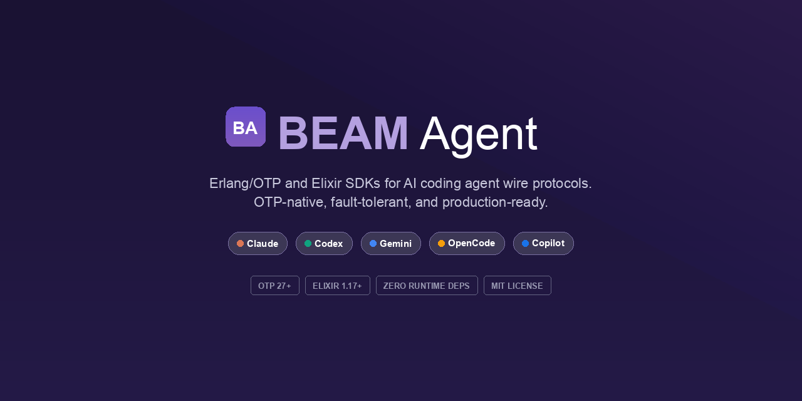

<p align="center">
  
</p>

# BEAM Agent

Canonical BEAM SDKs for integrating subscription-backed coding agents into
Erlang/OTP and Elixir applications.

The canonical public SDK surfaces are now:

- `beam_agent` for Erlang
- `BeamAgent` for Elixir

They let callers choose **Claude Code**, **Codex CLI**, **Gemini CLI**,
**OpenCode**, or **GitHub Copilot** at runtime while working against one
capability-oriented API surface.

## Architecture

All five backends share a three-layer architecture:

```
Consumer → beam_agent / BeamAgent (canonical public API)
         → beam_agent_session_engine (gen_statem — lifecycle, queue, telemetry)
         → beam_agent_session_handler callbacks (per-backend protocol logic)
         → beam_agent_transport (byte I/O — port, HTTP, WebSocket)
```

Each backend facade module implements the `beam_agent_adapter` behaviour
(identity and capabilities) and the `beam_agent_adapter_session` sub-behaviour
(session lifecycle). Under the hood, a `beam_agent_session_handler` callback
module handles the wire protocol for the engine. The engine provides all shared
orchestration (state machine, consumer/queue, telemetry, error recovery) so
handlers focus only on what is unique to their backend's wire protocol. Zero
additional processes — the engine gen_statem IS the session process.

```
                     +----------------------+
                     |      beam_agent      |
                     | canonical Erlang SDK |
                     +----------+-----------+
                                |
               +----------------+----------------+
               |  beam_agent_session_engine      |
               |  (gen_statem: lifecycle/queue/   |
               |   telemetry/error recovery)     |
               +----------------+----------------+
                                |
       +-------------+----------+----------+-------------+-------------+
       |             |                     |             |             |
 +-----+-----+ +-----+-----+         +-----+-----+ +-----+-----+ +-----+-----+
 | Claude    | | Codex     |         | Gemini    | | OpenCode  | | Copilot   |
 | handler   | | handler   |         | handler   | | handler   | | handler   |
 | port/jsonl| | port/rpc  |         | port/rpc  | | http/sse  | | port/jsonrpc|
 +-----------+ +-----------+         +-----------+ +-----------+ +-----------+
```

Those backend handlers are internal implementation modules inside the single
`beam_agent` project, not separate SDK packages.

All five handlers normalize messages into `beam_agent:message()` — a common map
type you can pattern-match on regardless of which agent you're talking to.

`beam_agent` is not only shared plumbing. It is the union-capability layer the
repo is building and verifying toward: when a backend supports a feature
natively, the handler can route to that implementation; when it does not,
`beam_agent` provides the universal fallback recorded in the architecture
matrices.

To add a new agentic backend, implement three modules: a facade implementing
`beam_agent_adapter`, a session module implementing `beam_agent_adapter_session`,
and a handler implementing `beam_agent_session_handler`. Stateless API backends
implement `beam_agent_adapter` plus `beam_agent_adapter_api` instead. See the
[Backend Integration Guide](docs/guides/backend_integration_guide.md) for a
complete walkthrough.

## Quick Start

### Erlang

Add the canonical SDK to your `rebar.config` deps:

```erlang
{deps, [
    {beam_agent, {path, "."}}
]}.
```

```erlang
%% Start a routed session through the canonical SDK
{ok, Session} = beam_agent:start_session(#{
    backend => auto,
    routing => #{
        policy => preferred_then_fallback,
        preferred_backends => [claude, codex]
    },
    cli_path => "/usr/local/bin/claude",
    permission_mode => <<"bypassPermissions">>
}),

%% Blocking query — returns all messages
{ok, Messages} = beam_agent:query(Session, <<"Explain OTP supervisors">>),

%% Find the result
[Result | _] = [M || #{type := result} = M <- Messages],
io:format("~s~n", [maps:get(content, Result, <<>>)]),

beam_agent:stop(Session).
```

### Elixir

```elixir
# In mix.exs
defp deps do
  [{:beam_agent_ex, path: "beam_agent_ex"}]
end
```

```elixir
{:ok, session} =
  BeamAgent.start_session(
    backend: :auto,
    routing: %{policy: :preferred_then_fallback, preferred_backends: [:claude, :codex]},
    cli_path: "claude"
  )

# Streaming query — lazy enumerable
session
|> BeamAgent.stream!("Explain GenServer")
|> Enum.each(fn msg ->
  case msg.type do
    :text -> IO.write(msg.content)
    :result -> IO.puts("\n--- Done ---")
    _ -> :ok
  end
end)

BeamAgent.stop(session)
```

Backend-specific wrappers such as `ClaudeEx`, `CodexEx`, `GeminiEx`,
`OpencodeEx`, and `CopilotEx` still exist. Use them when you want a preset
backend boundary or direct access to backend-native APIs from within the single
`beam_agent_ex` package.

## Adapters at a Glance

| Adapter | CLI | Transport | Protocol | Bidirectional |
|---------|-----|-----------|----------|---------------|
| `claude_agent_sdk` | `claude` | Port | JSONL | Yes (control protocol) |
| `codex_app_server` | `codex` | Port / WebSocket | JSON-RPC / JSONL / Realtime WS | Yes (app-server or direct realtime) or No (exec) |
| `gemini_cli_client` | `gemini --experimental-acp` | Port | JSON-RPC over NDJSON | Yes (persistent ACP session) |
| `opencode_client` | `opencode serve` | HTTP + SSE | REST + SSE | Yes |
| `copilot_client` | `copilot` | Port | JSON-RPC / Content-Length | Yes (bidirectional) |

## Canonical API Surface

`beam_agent` / `BeamAgent` expose the shared lifecycle/query surface directly:

```erlang
start_session(Opts)    -> {ok, Pid} | {error, Reason}
stop(Pid)              -> ok
query(Pid, Prompt)     -> {ok, [Message]} | {error, Reason}
query(Pid, Prompt, Params) -> {ok, [Message]} | {error, Reason}
health(Pid)            -> ready | connecting | initializing | active_query | error
session_info(Pid)      -> {ok, Map} | {error, Reason}
set_model(Pid, Model)  -> {ok, term()} | {error, term()}
set_permission_mode(Pid, Mode) -> {ok, term()} | {error, term()}
session_capabilities(Pid) -> {ok, [Capability]} | {error, term()}
child_spec(Opts)       -> supervisor:child_spec()
```

`start_session/1` accepts either an explicit backend or `backend => auto`
plus a `routing` request map. The canonical routing domain is exposed through
`beam_agent_routing` / `BeamAgent.Routing`.

Scheduled execution is exposed through `beam_agent_routines` /
`BeamAgent.Routines`. The routines layer stores durable job records and
provides explicit `run_due/1` entrypoints for caller-owned schedulers; it
does not start a hidden BeamAgent scheduler process.

Parent-child orchestration is exposed through `beam_agent_orchestrator` /
`BeamAgent.Orchestrator`. The orchestrator layer records delegation lineage,
cross-session child relationships, and collection/cancellation status without
starting a worker pool or resident BeamAgent process.

Elixir adds `stream!/3` and `stream/3` (lazy `Stream.resource/3`-based
enumerables) on top of the same canonical surface.

Beyond the lifecycle/query surface, the canonical SDK exposes the following
capability families through domain modules (`beam_agent_session_store`,
`beam_agent_threads`, `beam_agent_runtime`, `beam_agent_config`,
`beam_agent_provider`, `beam_agent_catalog`, `beam_agent_capabilities`,
`beam_agent_command`, `beam_agent_command_validator`, `beam_agent_control`, `beam_agent_mcp`,
`beam_agent_skills`, `beam_agent_artifacts`,
`beam_agent_context`, `beam_agent_journal`, `beam_agent_memory`,
`beam_agent_orchestrator`, `beam_agent_routing`, `beam_agent_routines`,
`beam_agent_checkpoint`, `beam_agent_hooks`, `beam_agent_policy`, `beam_agent_runs`,
`beam_agent_telemetry`).
Their status and route shape for each
backend/capability pair are tracked via
`support_level`, `implementation`, and `fidelity` in the capability registry.
All families have universal fallback coverage:

- shared session history/state
- shared/native thread management
- canonical run and step lifecycle
- typed artifact and context storage
- context pressure estimation and policy-driven compaction
- durable canonical domain-event journal
- durable audit records layered on the journal
- long-term memory with lexical recall and expiry
- internal store abstraction with ETS as the default canonical adapter
- reusable policy profiles for approvals, commands, backends, routines,
  memory writes, compaction, and orchestration
- policy-driven backend routing with explicit, sticky, round-robin, failover,
  capability-first, and preferred-then-fallback selection
- durable routines and caller-driven scheduled execution
- parent-child orchestration, delegation lineage, and run collection
- runtime provider and agent defaults
- universal config/provider fallbacks for backends without native admin APIs
- universal review/realtime participation for backends without native review APIs
- attachment materialization with size gating (512 KB default, configurable): native content blocks for Claude, canonical blocks for Gemini, text fallback for unknown backends
- catalog accessors for tools/skills/plugins/agents
- capability introspection (`support_level`, `implementation`, `fidelity`)
- raw native escape hatches for backend-specific APIs
- backend event streaming through native transports or the universal event bus

Shared session history/state and thread management:

```erlang
%% Universal session history/state — beam_agent_session_store
beam_agent_session_store:list_sessions(Opts)                    -> {ok, [SessionMeta]}
beam_agent_session_store:get_session(SessionId)                 -> {ok, SessionMeta} | {error, not_found}
beam_agent_session_store:get_session_messages(SessionId, Opts)  -> {ok, [Message]} | {error, not_found}
beam_agent_session_store:delete_session(SessionId)              -> ok
beam_agent_session_store:fork_session(SessionId, Opts)         -> {ok, SessionMeta} | {error, not_found}
beam_agent_session_store:revert_session(SessionId, Selector)   -> {ok, SessionMeta} | {error, not_found | invalid_selector}
beam_agent_session_store:unrevert_session(SessionId)           -> {ok, SessionMeta} | {error, not_found}
beam_agent_session_store:share_session(SessionId, Opts)        -> {ok, session_share()} | {error, not_found}
beam_agent_session_store:unshare_session(SessionId)            -> ok | {error, not_found}
beam_agent_session_store:summarize_session(SessionId, Opts)    -> {ok, session_summary()} | {error, not_found}
beam_agent_session_store:export_session(SessionId)             -> {ok, exported_session()} | {error, not_found}
beam_agent_session_store:import_session(Exported)              -> {ok, session_meta()} | {error, Reason}
beam_agent_session_store:import_session(Exported, Opts)        -> {ok, session_meta()} | {error, Reason}

%% Universal/native thread state — beam_agent_threads
beam_agent_threads:thread_start(Session, Opts)         -> {ok, ThreadMeta} | {error, Reason}
beam_agent_threads:thread_resume(Session, ThreadId)    -> {ok, ThreadMeta} | {error, not_found}
beam_agent_threads:thread_list(Session)                -> {ok, [ThreadMeta]} | {error, Reason}
beam_agent_threads:thread_fork(Session, ThreadId, Opts)-> {ok, ThreadMeta} | {error, not_found | message_limit_reached}
beam_agent_threads:thread_read(Session, ThreadId, Opts)-> {ok, map()} | {error, not_found}
beam_agent_threads:thread_archive(Session, ThreadId)   -> {ok, map()} | {error, not_found}
beam_agent_threads:thread_unarchive(Session, ThreadId) -> {ok, map()} | {error, not_found}
beam_agent_threads:thread_rollback(Session, ThreadId, Selector) ->
    {ok, map()} | {error, Reason}

%% Canonical runs/steps -- beam_agent_runs
beam_agent_runs:start_run(Scope, Opts)                   -> {ok, Run} | {error, Reason}
beam_agent_runs:get_run(RunId)                           -> {ok, Run} | {error, not_found}
beam_agent_runs:list_runs(Filter)                        -> {ok, [Run]} | {error, Reason}
beam_agent_runs:complete_run(RunId, Result)              -> {ok, Run} | {error, Reason}
beam_agent_runs:fail_run(RunId, ErrorTerm)               -> {ok, Run} | {error, Reason}
beam_agent_runs:cancel_run(RunId, Reason)                -> {ok, Run} | {error, Reason}
beam_agent_runs:start_step(RunId, Opts)                  -> {ok, Step} | {error, Reason}
beam_agent_runs:get_step(RunId, StepId)                  -> {ok, Step} | {error, not_found}
beam_agent_runs:list_steps(RunId)                        -> {ok, [Step]} | {error, not_found}
beam_agent_runs:complete_step(RunId, StepId, Result)     -> {ok, Step} | {error, Reason}
beam_agent_runs:fail_step(RunId, StepId, ErrorTerm)      -> {ok, Step} | {error, Reason}
beam_agent_runs:cancel_step(RunId, StepId, Reason)       -> {ok, Step} | {error, Reason}

%% Canonical artifacts -- beam_agent_artifacts
beam_agent_artifacts:put(Artifact)                       -> {ok, ArtifactRecord} | {error, Reason}
beam_agent_artifacts:get(ArtifactId)                     -> {ok, ArtifactRecord} | {error, not_found}
beam_agent_artifacts:list(Filter)                        -> {ok, [ArtifactRecord]} | {error, Reason}
beam_agent_artifacts:search(Query)                       -> {ok, [ArtifactRecord]}
beam_agent_artifacts:search(Query, Filter)               -> {ok, [ArtifactRecord]} | {error, Reason}
beam_agent_artifacts:attach(ArtifactId, RefType, RefId)  -> ok | {error, Reason}
beam_agent_artifacts:delete(ArtifactId)                  -> ok | {error, not_found}

%% Durable canonical journal -- beam_agent_journal
beam_agent_journal:append(EventType, Event)              -> {ok, Entry} | {error, Reason}
beam_agent_journal:list(Filter)                          -> {ok, [Entry]} | {error, Reason}
beam_agent_journal:stream_from(Cursor, Filter)           -> {ok, [Entry]} | {error, Reason}
beam_agent_journal:get(EventId)                          -> {ok, Entry} | {error, not_found}
beam_agent_journal:ack(ConsumerId, EventId)              -> ok | {error, not_found}

%% Canonical audit (layered on journal) -- beam_agent_journal
beam_agent_journal:list_events(Filter)                   -> {ok, [Entry]} | {error, Reason}
beam_agent_journal:get_event(EventId)                    -> {ok, Entry} | {error, not_found}

%% Long-term memory -- beam_agent_memory
beam_agent_memory:remember(Scope, MemoryInput)           -> {ok, Memory} | {error, Reason}
beam_agent_memory:remember(Scope, Kind, MemoryInput)     -> {ok, Memory} | {error, Reason}
beam_agent_memory:get(MemoryId)                          -> {ok, Memory} | {error, not_found}
beam_agent_memory:list(Filter)                           -> {ok, [Memory]} | {error, Reason}
beam_agent_memory:recall(Scope, Query)                   -> {ok, [Memory]} | {error, Reason}
beam_agent_memory:search(Query, Filter)                  -> {ok, [Memory]} | {error, Reason}
beam_agent_memory:forget(MemoryId)                       -> ok | {error, not_found}
beam_agent_memory:update(MemoryId, Changes)              -> {ok, Memory} | {error, Reason}
beam_agent_memory:pin(MemoryId)                          -> ok | {error, not_found}
beam_agent_memory:unpin(MemoryId)                        -> ok | {error, not_found}
beam_agent_memory:expire(Filter)                         -> {ok, Count} | {error, Reason}
beam_agent_memory:configure_persistence(StoreConfig)     -> ok | {error, Reason}

%% Canonical backend routing -- beam_agent_routing
beam_agent_routing:select_backend(RouteRequest)          -> {ok, Decision} | {error, Reason}
beam_agent_routing:select_backend(SessionOrOpts, RouteRequest) ->
    {ok, Decision} | {error, Reason}

%% Canonical policy profiles -- beam_agent_policy
beam_agent_policy:put_profile(ProfileId, Profile)        -> ok | {error, Reason}
beam_agent_policy:get_profile(ProfileId)                 -> {ok, Profile} | {error, not_found}
beam_agent_policy:list_profiles()                        -> {ok, [Profile]}
beam_agent_policy:evaluate(ProfileId, Action, Context)   -> allow | {deny, Reason}

%% Canonical routines -- beam_agent_routines
beam_agent_routines:create(Job)                          -> {ok, JobRecord} | {error, Reason}
beam_agent_routines:update(JobId, Patch)                -> {ok, JobRecord} | {error, Reason}
beam_agent_routines:due(Filter)                         -> {ok, [JobRecord]} | {error, Reason}
beam_agent_routines:run_due(Opts)                       -> {ok, [map()]} | {error, Reason}
beam_agent_routines:run_now(JobId)                      -> {ok, Run} | {error, Reason}
beam_agent_routines:next_due_at()                       -> {ok, DueAt} | {error, none}

%% Canonical orchestration -- beam_agent_orchestrator
beam_agent_orchestrator:spawn(Parent, Opts)             -> {ok, Child} | {error, Reason}
beam_agent_orchestrator:delegate(Parent, Task, Opts)    -> {ok, Run} | {error, Reason}
beam_agent_orchestrator:await(RunId, Timeout)           -> {ok, Result} | {error, Reason}
beam_agent_orchestrator:collect(RunId, Opts)            -> {ok, map()} | {error, Reason}
beam_agent_orchestrator:cancel(RunId, Reason)           -> ok | {error, Reason}
beam_agent_orchestrator:status(RunId)                   -> {ok, map()} | {error, not_found}
beam_agent_orchestrator:list_children(Parent)           -> {ok, [map()]} | {error, Reason}

%% Canonical context management -- beam_agent_context
beam_agent_context:context_status(SessionOrThread)       -> {ok, Status} | {error, Reason}
beam_agent_context:budget_estimate(SessionOrThread)      -> {ok, Budget} | {error, Reason}
beam_agent_context:compact_now(SessionOrThread, Opts)    -> {ok, Result} | {error, Reason}
beam_agent_context:maybe_compact(SessionOrThread, Opts)  -> {ok, Result} | {error, Reason}
```

The Elixir `BeamAgent` wrapper exposes those stores directly through
`BeamAgent.SessionStore`, `BeamAgent.Threads`, `BeamAgent.Runs`, and
`BeamAgent.Artifacts`, `BeamAgent.Audit`, `BeamAgent.Context`,
`BeamAgent.Memory`, `BeamAgent.Orchestrator`, `BeamAgent.Policy`,
`BeamAgent.Routing`, `BeamAgent.Routines`, and
the runtime/catalog layers through `BeamAgent.Runtime`,
`BeamAgent.Catalog`, `BeamAgent.Capabilities`, and `BeamAgent.Raw`.
Internally, the newer canonical stores route through `beam_agent_store` with
`beam_agent_store_ets` as the default adapter and `beam_agent_store_dets` as
a durable disk-backed alternative. Both adapters preserve the existing
process-free reads plus hardened table-owner write sharding behavior. The DETS
adapter supports an `atomic_counters` option that uses OTP `atomics` for
lock-free concurrent counter increments. Elixir callers use `BeamAgent.Store`
for domain configuration and DETS helpers.

For a domain-by-domain explanation of ownership, storage, and process
boundaries, see [docs/guides/canonical_domain_guide.md](docs/guides/canonical_domain_guide.md).

## Unified Message Format

All adapters normalize messages to `beam_agent:message()`:

```erlang
#{type := text, content := <<"Hello!">>}
#{type := tool_use, tool_name := <<"Bash">>, tool_input := #{...}}
#{type := tool_result, tool_name := <<"Bash">>, content := <<"output...">>}
#{type := result, content := <<"Final answer">>, duration_ms := 5432}
#{type := error, content := <<"Something went wrong">>, category := unknown}
#{type := error, content := <<"Rate limit exceeded">>, category := rate_limit, retry_after := 30}
#{type := thinking, content := <<"Let me consider...">>}
#{type := system, subtype := <<"init">>, system_info := #{...}}
```

Pattern match on `type` for dispatch:

```erlang
handle_message(#{type := text, content := Content}) ->
    io:format("~s", [Content]);
handle_message(#{type := tool_use, tool_name := Name}) ->
    io:format("Using tool: ~s~n", [Name]);
handle_message(#{type := error, category := rate_limit} = Msg) ->
    Retry = maps:get(retry_after, Msg, 60),
    io:format("Rate limited — retry in ~B seconds~n", [Retry]);
handle_message(#{type := error, category := Cat, content := Content}) ->
    io:format("Error [~p]: ~s~n", [Cat, Content]);
handle_message(#{type := result} = Msg) ->
    io:format("Done! Cost: $~.4f~n", [maps:get(total_cost_usd, Msg, 0.0)]);
handle_message(_Other) ->
    ok.
```

## SDK Features

### Structured Error Categorization

Every error message carries a `category` atom for structured error handling
without content-text parsing. Categories are inferred automatically from
wire-format data (when the backend provides structured error info) or from
content text pattern matching as a universal fallback.

| Category | Meaning |
|----------|---------|
| `rate_limit` | Too many requests / 429 / throttled |
| `subscription_exhausted` | Quota, billing, or credit limit reached |
| `context_exceeded` | Context window or token limit exceeded |
| `auth_expired` | Authentication or authorization failure |
| `server_error` | Backend 5xx / overloaded / unavailable |
| `unknown` | Unrecognized error (fallback) |

When available, `retry_after` (integer seconds) is also attached.

```erlang
handle_error(#{category := rate_limit, retry_after := Secs}) ->
    timer:sleep(Secs * 1000),
    retry;
handle_error(#{category := context_exceeded}) ->
    compact_and_retry;
handle_error(#{category := auth_expired}) ->
    {stop, reauthenticate};
handle_error(#{category := Cat, content := Content}) ->
    logger:warning("~p error: ~s", [Cat, Content]),
    {stop, Cat}.
```

### Backend Event Streams

The public API exposes a canonical event-stream interface for every backend.

Erlang:

```erlang
ok = beam_agent:event_subscribe(Session),
receive
    {beam_agent_event, Session, Event} ->
        io:format("Event: ~p~n", [Event])
after 30_000 ->
    timeout
end,
ok = beam_agent:event_unsubscribe(Session, self()).
```

`receive_event/2,3` provides a convenience wrapper with an optional timeout:

```erlang
{ok, Event} = beam_agent:receive_event(Session, 30_000).
```

Elixir:

```elixir
session
|> BeamAgent.event_stream!(timeout: 30_000)
|> Enum.each(&IO.inspect/1)
```

Backends with richer native event feeds keep them. For the rest, BeamAgent
provides the shared event-bus fallback documented in
`docs/architecture/backend_conformance_matrix.md`.

### Codex Direct Realtime Voice

Codex can also run a direct realtime session instead of the app-server path:

```erlang
{ok, Session} = beam_agent:start_session(#{
    backend => codex,
    transport => realtime,
    api_key => <<"sk-live-key">>,
    voice => <<"alloy">>
}),
{ok, #{thread_id := ThreadId}} =
    beam_agent_control:thread_realtime_start(Session, #{mode => <<"voice">>}),
ok = beam_agent_control:thread_realtime_append_text(Session, ThreadId, #{text => <<"Hello">>}),
ok = beam_agent:stop(Session).
```

That path uses the direct realtime websocket transport for Codex-native
audio/text sessions while the app-server transport remains available for the
broader CLI control-plane surface.

Realtime sessions support the full SDK hook lifecycle — `session_start`,
`session_end`, `user_prompt_submit` (blocking), `stop`, and
`post_tool_use_failure` — so the same hooks registered for app-server
sessions fire in realtime mode as well:

```erlang
Hook = beam_agent_hooks:hook(user_prompt_submit, fun(Ctx) ->
    %% Inspect or modify the prompt before it's sent over WebSocket
    {ok, Ctx}
end),
{ok, Session} = beam_agent:start_session(#{
    backend => codex,
    transport => realtime,
    api_key => <<"sk-live-key">>,
    sdk_hooks => [Hook]
}).
```

### MCP (Model Context Protocol)

The SDK includes a full MCP 2025-06-18 implementation with four layers:

| Layer | Module | Purpose |
|-------|--------|---------|
| Protocol | `beam_agent_mcp_protocol` | JSON-RPC 2.0 message constructors, validators, and encoders for the MCP spec |
| Server dispatch | `beam_agent_mcp_dispatch` | Server-side state machine — lifecycle, capability negotiation, request routing |
| Client dispatch | `beam_agent_mcp_client_dispatch` | Client-side state machine — request/response tracking, timeouts, server capability discovery |
| Tool registry | `beam_agent_tool_registry` | In-process tool registration, dispatch, and session-scoped registry management |
| Transports | `beam_agent_mcp_transport_stdio`, `beam_agent_mcp_transport_http` | Stdio (line-delimited JSON) and Streamable HTTP transports |

The public API is `beam_agent_mcp` (Erlang) / `BeamAgent.MCP` (Elixir).

#### In-Process MCP Tool Servers

Define custom tools as Erlang functions that Claude can call:

```erlang
Tool = beam_agent_mcp:tool(
    <<"lookup_user">>,
    <<"Look up a user by ID">>,
    #{<<"type">> => <<"object">>,
      <<"properties">> => #{<<"id">> => #{<<"type">> => <<"string">>}}},
    fun(Input) ->
        Id = maps:get(<<"id">>, Input, <<>>),
        {ok, [#{type => text, text => <<"User: ", Id/binary>>}]}
    end
),
Server = beam_agent_mcp:server(<<"my-tools">>, [Tool]),
{ok, Session} = beam_agent:start_session(#{
    backend => claude,
    sdk_mcp_servers => [Server]
}).
```

#### MCP Server Dispatch

Build a full MCP server that handles the protocol lifecycle:

```erlang
%% Create a server dispatch state machine
State = beam_agent_mcp:new_dispatch(
    #{name => <<"my-server">>, version => <<"1.0.0">>},
    #{tools => true, resources => true},
    #{tool_registry => Registry, provider => MyProviderModule}
),

%% Feed incoming JSON-RPC messages through the state machine
{Responses, NewState} = beam_agent_mcp:dispatch_message(IncomingMsg, State).
```

#### MCP Client Dispatch

Connect to an MCP server as a client:

```erlang
%% Create a client dispatch state machine
Client = beam_agent_mcp:new_client(
    #{name => <<"my-client">>, version => <<"1.0.0">>},
    #{roots => true, sampling => true},
    #{handler => MyHandlerModule}
),

%% Build and send the initialize request
{InitMsg, Client1} = beam_agent_mcp:client_send_initialize(Client),
%% ... send InitMsg over transport, receive response ...
{Events, Client2} = beam_agent_mcp:client_handle_message(Response, Client1),

%% Complete the handshake
{InitializedMsg, Client3} = beam_agent_mcp:client_send_initialized(Client2),

%% List available tools
{ToolsReq, Client4} = beam_agent_mcp:client_send_tools_list(Client3).
```

### SDK Lifecycle Hooks

Register callbacks at key session lifecycle points. Hooks receive a context
map and return a three-way result: `{ok, Ctx}` (allow, continue chain with
possibly modified context), `{deny, Reason}` (block the action), or
`{ask, Reason}` (escalate to caller for decision).

```erlang
%% Block dangerous tool calls
Hook = beam_agent_hooks:hook(pre_tool_use, fun(Ctx) ->
    case maps:get(tool_name, Ctx, <<>>) of
        <<"Bash">> -> {deny, <<"Shell access denied">>};
        _ -> {ok, Ctx}
    end
end),
{ok, Session} = beam_agent:start_session(#{
    backend => claude,
    sdk_hooks => [Hook]
}).
```

Blocking events (may return `{deny, _}` or `{ask, _}` to prevent the action):
`pre_tool_use`, `user_prompt_submit`, `permission_request`, `subagent_start`,
`pre_compact`, `config_change`.

Notification-only events (always proceed regardless of return value):
`post_tool_use`, `post_tool_use_failure`, `stop`, `session_start`,
`session_end`, `subagent_stop`, `notification`, `task_completed`,
`teammate_idle`.

Crash protection: each callback is wrapped in try/catch. Blocking hook
crashes return `{deny, <<"hook crashed (fail-safe deny)">>}` (fail-closed) —
a security hook that crashes must not allow the action through unchecked.
Notification hook crashes are logged and the context passes through
unmodified (fail-open).

### Telemetry

BeamAgent emits telemetry at key points across both backend session handling and
the canonical runtime domains added in this repo: query lifecycle, command
execution, run and step lifecycle, routing decisions, artifact and memory
operations, journal replay, routines, orchestration, policy evaluation, audit,
context compaction, and buffer overflow. The `telemetry` library is an
**optional** dependency — when present, events are emitted via
`telemetry:execute/3`; when absent, emission is a silent no-op with zero
overhead.

To opt in, add `{telemetry, "~> 1.3"}` to your application's `deps` and
`applications` list, then attach handlers:

```erlang
telemetry:attach(my_handler, [beam_agent, command, run, stop], fun handle/4, #{}).
```

Representative events:
- `[beam_agent, claude, query, start|stop|exception]`
- `[beam_agent, command, run, start|stop|exception]`
- `[beam_agent, run, state_change]`
- `[beam_agent, artifact, put|search, start|stop|exception]`
- `[beam_agent, journal, append|stream_from, start|stop|exception]`
- `[beam_agent, memory, remember|update|search, start|stop|exception]`
- `[beam_agent, routing, select_backend, start|stop|exception]`
- `[beam_agent, context, maybe_compact, start|stop|exception]`
- `[beam_agent, context, state_change]`
- `[beam_agent, routine, create|run_due, start|stop|exception]`
- `[beam_agent, orchestrator, delegate|collect, start|stop|exception]`
- `[beam_agent, policy, evaluate, start|stop|exception]`
- `[beam_agent, audit, record|list_events, start|stop|exception]`
- `[beam_agent, buffer, overflow]`

### ETS Initialization

Call `beam_agent:init/0,1` before starting sessions to initialize the
SDK's ETS tables. In the default `public` mode all tables use public
access (zero overhead). Opt into `hardened` mode to protect tables and
proxy writes through a linked owner process:

```erlang
%% Default — public access, zero overhead
ok = beam_agent:init().

%% Hardened — protected tables, proxied writes, zero-cost reads
ok = beam_agent:init(#{table_access => hardened}).
```

If `init/1` is never called, tables are created lazily with public access
on first use.

### Supervisor Integration

Embed sessions in your supervision tree:

```erlang
%% In your supervisor init/1
ok = beam_agent:init(),
Children = [
    beam_agent:child_spec(#{
        backend => claude,
        cli_path => "/usr/local/bin/claude",
        session_id => <<"worker-1">>
    })
],
{ok, {#{strategy => one_for_one}, Children}}.
```

### Universal Session and Thread Stores

The common session/thread APIs are backed by `beam_agent_store` inside
`beam_agent` so every adapter can expose the same high-level capability
surface, even when the underlying SDK does not implement it directly.

```erlang
%% Query shared history
{ok, Sessions} = beam_agent_session_store:list_sessions(),
{ok, Messages} = beam_agent_session_store:get_session_messages(<<"sid">>),

%% Restore a previous session (native resume when available)
{ok, Restored} = beam_agent:restore_session(<<"sid">>, #{}),
{ok, Msgs} = beam_agent:query(Restored, <<"Pick up where we left off">>),

%% Create and inspect universal threads
{ok, Thread} = beam_agent_threads:thread_start(Session, #{}),
{ok, ThreadInfo} = beam_agent_threads:thread_read(
    Session, maps:get(thread_id, Thread), #{include_messages => true}
).
```

## Project Structure

```
beam-agent/
  src/
    public/             Canonical beam_agent public modules
    core/               Shared runtime, routing, control, MCP, hooks
    stores/             Store adapters (beam_agent_store_ets, beam_agent_store_dets)
    transports/         Reusable transport-family modules
    backends/           Internal backend implementations
  test/
    public/             Canonical public-surface tests
    core/               Shared-runtime tests
    backends/           Backend-specific tests
  beam_agent_ex/
    lib/
      beam_agent/       Canonical BeamAgent modules
      *.ex              BeamAgent + backend-specific Elixir wrappers
    test/
      canonical/        BeamAgent public wrapper tests
      wrappers/         Backend-specific Elixir wrapper tests
```

## Building

### Erlang

```bash
rebar3 compile          # Build the canonical beam_agent OTP app
rebar3 eunit --app beam_agent
rebar3 dialyzer         # Static analysis
rebar3 check            # compile + dialyzer + eunit + ct
```

### Elixir Wrapper

```bash
cd beam_agent_ex
mix deps.get
mix test
mix dialyzer               # Static analysis (via Dialyxir)
```

## Requirements

- Erlang/OTP 27+
- Elixir 1.17+ (for wrappers)
- OTP built-ins: `crypto`, `ssl`, `inets`, `public_key` (for HTTP/WebSocket transports)
- Optional: `telemetry` ~> 1.3 (for instrumentation — see [Telemetry](#telemetry))
- Test deps: `proper` 1.5.0

**Zero external runtime dependencies.** The SDK relies only on OTP standard
libraries. All third-party integrations (telemetry, metrics, tracing) are
opt-in by the consuming application.

## Package Documentation

The canonical packages are documented first. Backend-specific READMEs describe
native escape hatches and transport-specific behavior inside those packages.

**Canonical Packages:**
- `beam_agent` — Canonical Erlang SDK at the repo root
- [BeamAgent](beam_agent_ex/README.md) — Canonical Elixir wrapper

**Backend-Native Erlang Modules Inside `beam_agent`:**
- `claude_agent_sdk` — Claude Code adapter
- `codex_app_server` — Codex CLI adapter
- `gemini_cli_client` — Gemini CLI adapter
- `opencode_client` — OpenCode adapter
- `copilot_client` — GitHub Copilot adapter

**Compatibility / Native Elixir Modules Inside `beam_agent_ex`:**
- `ClaudeEx`
- `CodexEx`
- `GeminiEx`
- `OpencodeEx`
- `CopilotEx`

## License

See [LICENSE](LICENSE).
